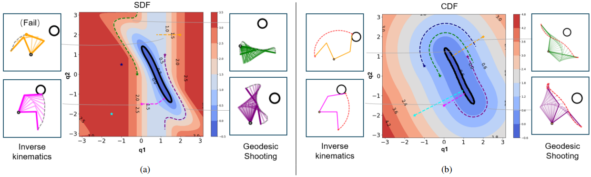
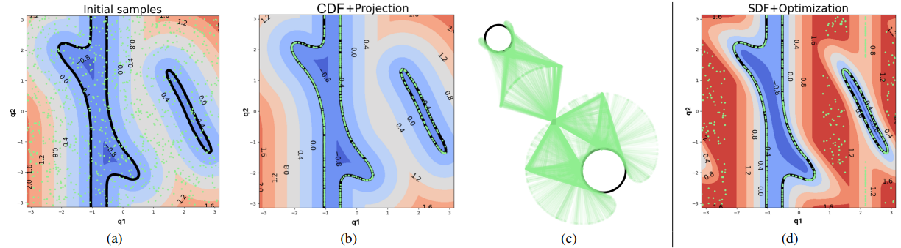

### Code for paper "Configuration Space Distance Fields for Manipulation Planning" (RSS 2024)

[[Paper]](https://arxiv.org/abs/2406.01137)[[Project]](https://sites.google.com/view/cdfmp)

CDF is a differentiable robot representation. It is a function d=f(p,q) where p is the spatial point and q is the joint configuration. DIfferent from SDF that indicates the distance from p to the robot surface defined by q, CDF uses the distance in radians, corresponding to the minimal joint motion required by the robot to contact with the point. Therefore, the distance is evenly spanned in joint space and the gradient points against to the point consistently, and we can solve the inverse kinematics problem through one-step gradient projection without the requirement of iterations.




#### Dependencies
- Python version: 3.8 (Tested)
- Pytorch version:1.13.0 (Tested)
- Install necessary packages

```sh
pip install -r requirements.txt
```

- Install [pytorch3d](https://pytorch3d.org/) (optional)

#### 2D examples

Run

```sh
python cdf.py
```
to see the main difference between SDFs and CDF. 

You can also replace the line 
```python
plot_fig1(scene_1)
```
with 
```python
plot_projection(scene_2)
```
to see how gradient projection works in solving inverse kinematics in one-step without iterations.

#### 7 axis Franka robot experiments

- We provide pretrained neural CDF model at 'model_dict.pt' and precomputed data ['data.pt'](https://drive.google.com/file/d/1vMs9M03gMBC8sZLV336S2bfFvYykO2Qz/view?usp=sharing) for franka emika panda robot. 

- Examples for data generation and neural network training can be found at 'data_generator.py' and  'nn_cdf.py'.

Note: Many funtions require the RDF library (such as offline data generation, comparison with SDFs). You can run 
```sh
git clone https://github.com/yimingli1998/RDF.git
```
and put it in the same folder with CDF. 

Run 
```sh
python mp_ik.py
```
to see the gradient projection works on the robot.

Run 
```sh
python throw_wik.py 
```
to see the goalkeeper experiment in simulation.

Run 
```sh
python wik_eval.py 
```
to evalute the whole-body inverse kinematics and compare it with baseline approaches.

For motion planning, you can run 

```sh
python qp_mp.py 
```

to see a simple example that uses a reactive QP controller for collision avoidance. this example is in a static scene but it also works for moving objects.

--------------------------------------------------------

CDF is maintained by Yiming LI and licensed under the MIT License.

Copyright (c) 2024 Idiap Research Institute <contact@idiap.ch>